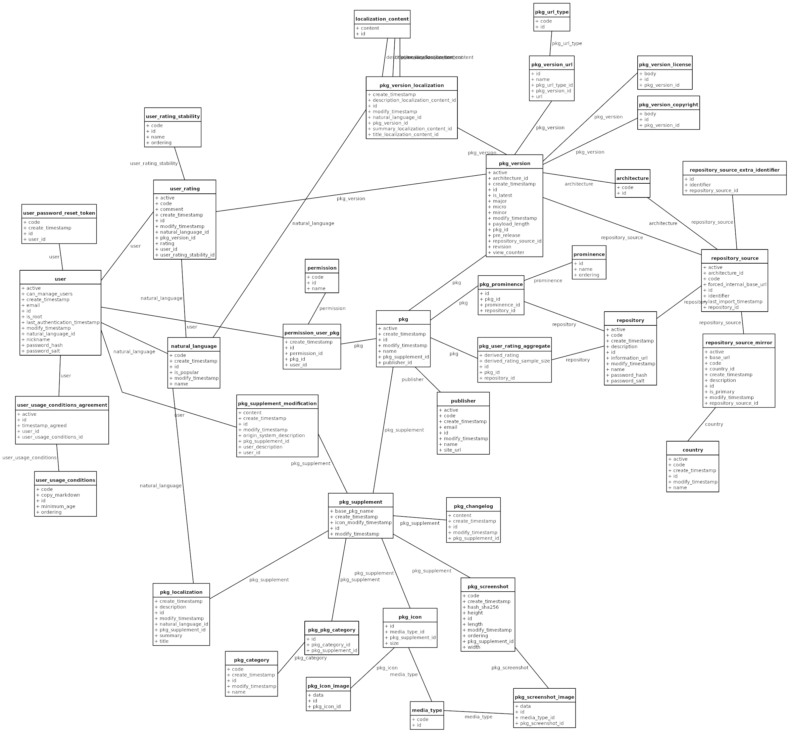

# Data Model

The persisted data model for the application server;

The diagram above does not show `modifyTimestamp` nor does it show `createTimestamp`.

## Unique Identifiers

In general, an `code` is used to identify instances of entities in the database.  For example, a UUID might be used such as `7cc57be5-ca7b-4229-a00b-084b32a4e1c3`. In some cases an existing natual key is already in place and so that attribute is used.  An example of this is the `Pkg` entity which is uniquely identified by its attribute `name`.  Note that the identifier is not the primary key.  In all cases, the database primary and foreign keys are artificial numerical identifiers that are supplied by sequences.

## Repositories

A package is a cohesive piece of software or software sub-system for the Haiku operating system.  This might for example be an application such as `bepdf` or `armyknife` or a command line tool such as `pari`.

`Repository`-s are sources of packages.  A repository has a number of repository sources.  Each `RepositorySource` covers an `Architecture` and each `RepositorySource` can have a number of `RepositorySourceMirror`-s. One `RepositorySourceMirror` is a "primary" Mirror for the repository and is where HaikuDepotServer will go to get updated data for this `RepositorySource` when it needs to.  A `RepositorySourceMirror` is associated with a `Country` and in this way it is possible to identify a good source of repository data to use dependent on a user's physical location.

The `RepositorySource` contains an `identifier` field and this string acts as an identifier for the `RepositorySource`. The actual URLs where repository data can be fetched are found in the `RepositorySourceMirror`-s. You can find out more about this in the [repository](repositories.md) section.

Package versions' data is siloed between repositories, but some data such as localization, iconography and screenshots are shared.  This means that if you have the package `bepdf` made available in more than on repository, that package will share some aspects such as iconography and screenshots.

## Package Supplement

Some packages are loosely in a relationship with a main package.  For example, the package `aspell_devel` is subordinate to `aspell` and `qupzilla_x86` is subordinate to `qupzilla`.  In such cases, a relationship exists, by naming convention, wherein the subordinate package should take on some of the meta-data of the main package.  The system achieves this through the PkgSupplement entity.  A `PkgSupplement` entity instance holds the relationship to icons, screenshots, changelogs and categories and then any related `Pkg` entity instances relate to that `PkgSupplement`.

## Package Supplement Modification

Each time the user changes the `PackageSupplement` (an icon, a screenshot, localization ...) then a record is made as to who changed this. Because the data may change over time a description of the change is captured instead of linking to the actual entity which has changed.

The entry may not be linked to a user in the HDS system because the actual user who made the change might have come from another system altogether. In any case, the field `user_description` provides a description of user who did make the change.

## User Usage Conditions

User usage conditions are the terms by which a user is able to use the HDS system.  These should be agreed to before the user is able to make use of the system.  These are loaded into the database from compile-time resources in the HDS source code and are loaded into the `UserUsageConditions` table.  In this way, the compile-time resources act like a migration.

## Natural Languages

A natural language is something like German, Icelandic or Thai. The fallback language for HDS is English. A language is identified in the `natural_language` table by the following pieces of data;

- Language code; this is a 2 or 3 character lower case code such as `fr` or `fur`. The standard for these codes is ISO-3166-1.
- Country code; this is generally a two letter upper case code such as `DE` or `NZ`. The standard for these code is ISO-3166 or sometimes a UN M49 code such as `419` corresponding to Latin America and the Caribbean.
- Script code; this is a 4 character code that has a leading upper-case such as `Latn`. The standard for this is ISO-15924.

Sometimes the natural language is identified by the individual codes above or an overall code can be assembled by combining the codes above. The components are separated by a hyphen and ordering is language code, script code and then country code. For example `en-US` or `sr-Latn-BA`. On parse, either a hyphen or an underscore is accepted.

An ORM class `NaturalLanguage` exists to express a natural language in the database. An in-memory representation is provided by `NaturalLanguageCoordinate` and an interface `NaturalLanguageCoded` defines accessors for the codes and is implemented by both `NaturalLanguage` and `NaturalLanguageCoordinate`.