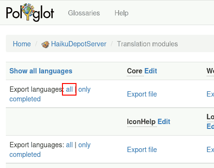

# Polygot

[Polygot](https://i18n.kacperkasper.pl) is the bespoke system uses for managing localizations. The localizations for the HDS application itself is included in Polygot.

## Update localizations for HDS

If you don't already have Python 3 on your machine, install it. You can check that Python 3 is installed and see the version by running the following from a terminal;

```
python3 -v
```

You will need version 3.10 or better.

Create a GitHub fork of the [HDS project](https://github.com/haiku/haikudepotserver/), clone it locally and create a new branch. Ensure that you are creating the branch from the `HEAD` of the `master` branch.

Using a web browser, authenticate with [Polygot](https://i18n.kacperkasper.pl) and download the data which will save as a `.zip` file.



Run a provided support script from the HDS source which will make filename corrections and splay the localization data into the HDS source;

```
python3 support/hdsupdatelocalization.py \
-i "/d/e/f/Downloads/HaikuDepotServer.zip" \
-o "/a/b/c/develop/haiku/haikudepotserver" 
```

Some diagnostic information will output to the console. If you are working in an IDE, view the change-set in your branch to verify the modifications looks sensible and that they include the changes you had intended.

Commit the changes, push your branch and then open a pull-request from the GitHub web user interface to request that the changes be merged into HDS's source code.

Once merged, the changes will be visible in the live system after the next deployment.